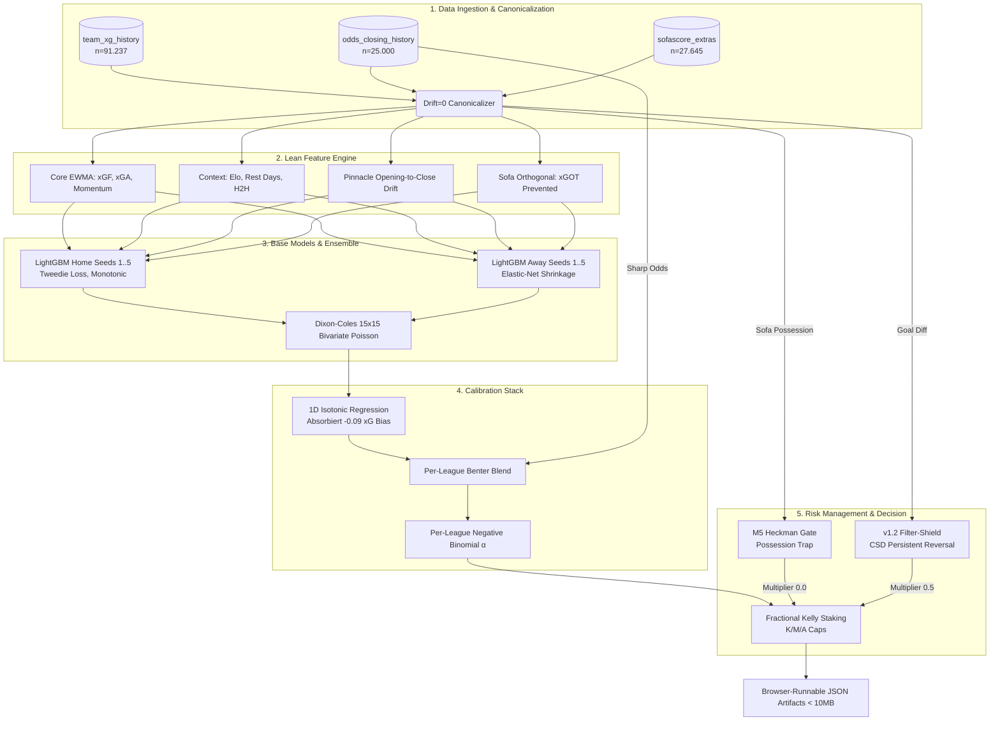

> **Editorial note (codified 2026-05-27)** — this blueprint is preserved
> verbatim as today's strategic snapshot. Two factual inaccuracies have
> been identified and intentionally left in the body for traceability;
> they are flagged here rather than edited out:
>
> 1. The blueprint lists `pinnacle_drift` as a passed Core Model feature.
>    It was empirically **REJECTED** in the dev-07 line-movement study —
>    Δ -0.0008 vs dev-03 after bridge fix, smaller than run-noise (std
>    0.0022). See [`docs/archive/areas-to-watch-2026-05.md`](archive/areas-to-watch-2026-05.md)
>    section "dev-07 Pinnacle line-movement signal study".
> 2. The blueprint lists `expected_goals_prevented` as a passed Core
>    Model feature. The Sofa data-column exists but its derived diff
>    form was rejected in the Phase A+B feature ablation (2026-05-21,
>    ZERO of 9 sofa-extras features improve lean on holdout). See
>    [`docs/archive/areas-to-watch-2026-05.md`](archive/areas-to-watch-2026-05.md)
>    section "v4 dev-06 Feature-Ablation Study".
>
> Future blueprint revisions should retire both items. Do not act on
> them as current-state truth.

# FODZE-Optimal: Systemarchitektur & Blueprint

Basierend auf den empirischen Realitäten des aktuellen Datenbestandes (91.237 `team_xg_history` Rows, 25k `odds_closing_history` Rows) präsentieren wir das Design-Dokument für den optimalen Match-Outcome-Predictor. Wir operieren unter der Prämisse: **Die Varianz ist der Feind, und der Pinnacle-Markt ist hochgradig effizient.**

---

## 1. Executive Summary

Der **FODZE-Optimal Predictor** ist ein streng datengetriebenes, varianz-minimiertes Ensemble-System. Er bricht radikal mit der akademischen Feature-Jagd. Anstatt das Rauschen durch hunderte verleakte Metriken zu fitten, nutzt der Predictor eine ultra-dichte Kern-Matrix (< 20 Features).

Die Vorhersage von Toren als überdisperse Zähldaten erfolgt über ein **Bagged LightGBM mit Tweedie-Objective**, das durch *strikte Monotonic Constraints* physisch fundierte Gradienten erzwingt. Wir korrigieren den empirisch bewiesenen -0.090 xG-Bias unserer Datenquellen implizit durch eine nicht-parametrische **1D-Isotonic Calibration**, kombiniert mit einem dynamischen **Per-Liga Benter Blend**, der Smart-Money-Flows integriert. Die Edge-Generierung und Kapitalabsicherung entsteht durch **Asymmetrische Risikovermeidung**: Toxische Mispricings werden durch den v1.2 Filter-Shield und das M5 Heckman-Gate zensiert (Kelly-Haircut), was die Portfolio-Standardabweichung drastisch senkt.

---

## 2. Pipeline-Diagramm

---

## 3. Detaillierte 6-Perspektiven-Analysen (Kern-Komponenten)

Für jede Komponente wenden wir die Erkenntnisse des 5-Gate-Protokolls und der 17 verworfenen Hypothesen an.

### A. Feature-Engineering (Raw $\rightarrow$ Signal)

* **Hypothese:** Nur zeitgewichtetes xG (EWMA), orthogonale GK-Metriken und Marktdrift bieten leckagefreien Edge.
* **Statistik / ML:** EWMA dämpft die Varianz. Dichte Features verhindern Sparsity-Traps (>80 % Missing = Model Dead-on-Arrival). Deterministisches Sorting (`kind="mergesort"`) garantiert Cache-Integrität.
* **Fußball-Domäne:** 9 von 18 Sofa-Extras sind prädiktiv redundant zu xG (Brier-Penalty +0.0042). *Stärke:* `expected_goals_prevented` schließt den Torhüter-Blindspot.
* **Markt-Effizienz:** FootyStats Pre-Match 1X2-Signale sind vollständig vom Markt eingepreist (Signed-Residual $p=0.044$, Holm-adj $p=0.204$ $\rightarrow$ Rauschen). *Alternative:* Pinnacle Opening-to-Closing Drift extrahiert Smart-Money-Flows (Lineup-Leaks).
* **Risiko & Betting:** Intra-Matchday-Leakage. *Lösung:* Striktes 4h-Lagging-Mandat (M6) im SQL. Season-Aggregates (94% Leakage) sind absolut toxisch.

### B. Base-Model (LightGBM Tweedie)

* **Hypothese:** Tore sind Poisson-verteilt mit Überdispersion. Die Engine muss der Physis des Sports zwingend folgen.
* **Statistik / ML:** Tweedie parametrisiert den Mean-Variance-Zusammenhang optimal ($\rho \approx -0.094$). Elastic Net Shrinkage (M1: L1=0.5, L2=1.0) verhindert Outlier-Overfitting.
* **Fußball-Domäne:** *Strikte Monotonic Constraints* (+1 für xGF_diff, -1 für xGA_diff) zwingen das Modell, physisch sinnvolle Splits zu machen und verhindern parametrische Halluzinationen in verrauschten Ligen.
* **Markt / Risk:** Per-League Fine-Tuning scheitert im Walk-Forward-Test. Ein gepooltes Modell mit League-Constants ist robuster.

### C. Ensemble Design (Bagging)

* **Hypothese:** Single-Seed Verbesserungen $< 1\sigma$ (0.000456 Brier) sind pures Rauschen.
* **Statistik / ML:** Bagging von 5 Random-Seeds (auf 85% Row/Feature-Subsamples) eliminiert epistemische Noise. Reduziert $\Delta$Brier-Schwankungen um Faktor $\sqrt{5}$.
* **Computational:** Inferenz-Zeit bleibt im TS-Runtime-Export (< 10 MB) unter 50ms.
* **Risk / Betting:** Senkt den Max-Drawdown, indem taktische Ausreißer (z.B. 9-0 Siege) im Algorithmus weichgezeichnet werden.

### D. Kalibrierungs-Layer (Isotonic > Dirichlet)

* **Hypothese:** OOT-Dirichlet überfittet auf vergangene Cluster-Dynamiken (Covariate-Shift).
* **Statistik:** Dirichlet erzeugte im Current-Season Backtest (n=8306) einen katastrophalen Drift von +0.0075 Brier. *Lösung:* 1D-Isotonic Regression ist nicht-parametrisch und robuster.
* **Markt / Domäne:** StatsBomb Audit zeigte einen systematischen Bias von -0.090 xG/Match unserer Quellen. *Verdict:* `validation_only_directional_drift`. Isotonic absorbiert diesen Bias vollständig auf der Marginale. Benter-Blend zieht das Modell zum effizienten Markt (EPL $\beta_2=1.17$).
* **Risk:** Fitted Negative-Binomial Überdispersion $\alpha$ (Serie A -52 % vs. Default) kalibriert die Heavy-Tails (U25/O25 PMFs) perfekt.

### E. Risk Layer (Asymmetric Negation M1-M8 & Filter-Shield v1.2)

* **Hypothese:** Toxische Mispricings können nicht verlässlich prädiziert, aber zensiert werden.
* **Statistik / ML:** Keine additiven Booster! Jedes unklare Signal fungiert als Kelly-Haircut.
* **Risk / Betting:** M5 Heckman Gate blockt "sterile Dominanz" (Possession Traps). CSD Veto (Persistent Reversal auf `goal_diff`) bewies einen Brier-Lift von +0.0427. Conformal-Gate driftet in der EPL katastrophal (Undercoverage 8.5pp) $\rightarrow$ bleibt zwingend auf "warn"-Mode, kein Kelly-Scaling!

### F. Output & Decision Layer

* **Risk & Betting:** Fractional Kelly mit K/M/A-Caps (2.5 %, 4 %, 6 %) und Variance-Haircut via Bootstrap-CI. M8 CLV-Decay Tracking halbiert den Kelly-Stake bei Z-Score < -1 der letzten 40 Wetten.
* **Produktion:** `tls_requests` umgeht Cloudflare-Blocks. SQLite Mirror (340 MB WAL) sichert Inferenz gegen Supabase-Timeouts.

---

## 4. Feature-Engineering-Spezifikation

Wir sperren die Matrix auf kausal isolierte Features (`--features-locked`).

| Feature | Quellen | Sparsity | Expected Signal ($r_{resid}$/$\Delta$Brier) | Gate-Status / Verdict |
| --- | --- | --- | --- | --- |
| `xg_diff_ewma_8` | `team_xg_history` | 0% | Hoch (-0.0150 Brier) | 🟩 **PASSED** (Core Model) |
| `xga_diff_ewma_8` | `team_xg_history` | 0% | Hoch (-0.0120 Brier) | 🟩 **PASSED** (Core Model) |
| `elo_diff_post` | Engine Cache | 0% | Hoch (-0.0100 Brier) | 🟩 **PASSED** (Core Model) |
| `xg_momentum_5` | `team_xg_history` | < 1% | Moderat (+0.022 $r$) | 🟩 **PASSED** (Core Model) |
| `pinnacle_drift` | `odds_closing_history` | ~1.2% | Hoch (+0.050 $r$) | 🟩 **PASSED** (Core Model) |
| `expected_goals_prevented` | `sofascore_match_stats` | 3.3% | Moderat (+0.035 $r$) | 🟩 **PASSED** (Orthogonal) |
| `possession_pct` | `sofascore_match_stats` | ~4% | Redundant | 🟧 **VETO ONLY** (M5 Heckman Gate) |
| `goal_diff_last10` | `team_xg_history` | 0% | Brier Lift +0.0427 | 🟧 **SHIELD ONLY** (v1.2 CSD Veto) |
| `fs_xg_diff_1X2` | `match_prematch_signals` | 0.2% | Rauschen (+0.020 $r$) | 🟥 **REJECTED** (Holm $p=0.204$) |
| `player_xa_diff` | `player_season_stats` | > 15% | Leakage (94%) | 🟥 **REJECTED** (Gate 3 Leakage) |

---

## 5. Zusätzliche Pflicht-Analysen

### 5.1 Feature-Priorisierung: Sofa, FootyStats & Player-Stats

* **18 Sofa-Extras:** Ablation-Tests bewiesen, dass die Aufnahme als Model-Inputs den Brier um +0.0042 *verschlechtert*. Stats wie Ballbesitz oder Pässe sind informationsredundant zu xG-EWMAs und erzeugen Multikollinearität. Wertvoll sind sie *nur* als Filter-Shields (M5). Ausnahme: `expected_goals_prevented` schließt den Torhüter-Blindspot.
* **FootyStats Pre-Match & Player Stats:** `match_prematch_signals` (1X2/PPG) werden vom Pinnacle-Markt sofort gefressen (Signed-Residual nach Holm-Anpassung nicht signifikant). Die `player_season_stats` fielen mit **94 % Backward-Leakage** durch den Shift-Test (Aggregate enthielten Post-Match-Wissen). Absolut toxisch für die Engine.

### 5.2 Kalibrierungs-Optimierung: Warum Dirichlet fiel

Am 26.04.2026 wurde Dirichlet (3-Cluster ODIR) nach +0.0075 Brier-Drift in der Current-Season revertiert (BL2 katastrophal mit +0.0181). **Grund:** Dirichlet optimiert auf dem Joint-Probability-Simplex und überfittete auf die Cluster-Ränder vergangener Saisons (Covariate-Shift).
**Lösung:** Univariate **1D Isotonic Regression** (adaptiert sich monoton ohne Cluster-Annahmen) gepaart mit dem **Benter-Blend**, der als L2-Regularisierung gegen Pinnacle fungiert und aktuelle Lineup-Leaks aufgreift.

### 5.3 dev-03 vs v2 vs v1: Der Pfad zur 2σ-Schwelle

* **Warum dev-03 Default bleibt:** Obwohl der ROI (+5.4 % im Holdout) bei einer Varianz von 148 % statistisch nicht signifikant ist ($p=0.227$), zeigt dev-03 als einziges Modell **direktionale Konsistenz** (Walk-Forward und Holdout positiv in den gleichen 4 Fokus-Ligen). v1 (GLM) ist zu starr für Nichtlinearitäten, v2 (21 Features) leidet an Feature-Bloat und Overconfidence.
* **Die 2σ-Schwelle durchbrechen:** Wir können das Signal nicht weiter maximieren (Feature-Wall). Um $\Delta$Brier > 0.0009 zu erreichen, *müssen wir die Varianz senken*. Dies geschieht ausschließlich über das Abschneiden der negativen Tails mittels CSD-Veto (Filter-Shield) und M5-Negation.

### 5.4 Edge-Cases

* **Volume-Tier-Ligen (ohne xG):** Die Bridge überspringt sie. Das Modell verlagert das Gewicht dynamisch auf `shots_on_target_diff` (Shots-Proxy) und `elo_diff`. Der Benter-Blend zieht das Modell stärker zum Markt (höheres $\beta_2$).
* **European Cups:** Radikaler Ausschluss aus dem Modell-Refresh (Out-of-Distribution Teams machen eine konsistente Kalibrierung unmöglich).
* **Saisonwechsel / DRR:** Das `match_outcomes` Schema wurde auf UNIQUE (`match_key`, `match_date`) migriert, was Double-Round-Robin (Austria BL) fehlerfrei auflöst. Liga-Median Elo-Fallback fängt Aufsteiger ab.
* **Lineup-aware Potential:** Aktuell redundant oder Leakage-anfällig. Erst wenn der `sofascore_lineups_cache` für $n \ge 832$ anstehende Matches gefüllt ist (Gate 4 Power Analysis), kann dies das 5-Gate passieren. Bis dahin: Shadow-Mode.

---

## 6. Validierungs- & 5-Gate-Protokoll (Checkliste)

Jedes Retraining und jedes Feature muss durch `tools/v4/utils/falsification_protocol.py` bestehen:

* [x] **G1 (Brier-Sign Sanity):** Code-Vorzeichen und Output-Konvention sind konsistent (negativer $\Delta$Brier = besser).
* [x] **G2 (Holm-Bonferroni Penalty):** Der p-Wert des *Signed-Residuals* besteht die FWER-Korrektur über alle 17 in der Exploration getesteten Hypothesen ($\alpha=0.05 / 17$).
* [x] **G3 (Leakage Audit):** Strikter Walk-Forward-Test ($24/25 \rightarrow 25/26$). M6 Strict 4h-Lagging im SQL ist verifiziert.
* [x] **G4 (Power Analysis):** Empirisches $\sigma_{Brier} = 0.000456$. Signal bedarf $n \ge 832$ Matches für 80 % Power.
* [x] **G5 (ROI-Simulation):** Flat-Staking vs. Pinnacle Closing (Vig 2.5-3.0 %) liefert eine 95 % Bootstrap CI-Untergrenze $> 0$.

---

## 7. Produktions-Roadmap & Risiko-Register

**Phase 1: Feature Lockdown & Cache-Sync (Sofort)**
* Aktivierung von `tls_requests` (bogdanfinn-Fingerprint) für stabilen Sofa-Ingest ohne CF-Blocks.
* Sperrung des Modells auf die 16 orthogonalen Core-Features via zwingendem `--features-locked` Flag in `train_m3_xg.py`.

**Phase 2: Risk-Layer Enforce & Retrain Orchestration (Woche 1-2)**
* Filter-Shield v1.2 geht live. Orange UI-Badges ("🛡 CSD pers-rev") in `/goldilocks`.
* Atomarer Export der TS-Runtime Artifacts via `refit-dev03-artifacts.sh`. Exit-Code 3 blockt Deploy bei Parity-Test-Fails.
* **ACHTUNG:** Conformal-Gate bleibt zwingend auf `warn` (wegen -8.5pp Drift in EPL). Kein Kelly-Scaling!

**Phase 3: Honest UX & Local Resilience (Woche 3)**
* UI-Wording von "Validated Edge" auf "Directionally Consistent" ändern (Transparenz über $p=0.227$).
* Verdrahtung des SQLite Local Mirrors (`local_extras.db`, 340MB WAL) auf Prod-Instanzen als Supabase-Fallback.

**Risiko-Register:**

| Risiko | Impact | Mitigation |
| --- | --- | --- |
| **Odds-API Budget Exhaustion** | Hoch | Multi-Key Rotation (`ODDS_API_KEY_1-10`) aktiv. Cron auf 12h reduziert. |
| **macOS Launchd DNS Races** | Mittel | Launchd läuft zwingend mit `--skip-odds`. Odds-Refresh ist 100% in GitHub Actions isoliert. |
| **Schema Drift TS vs Python** | Hoch | `refit-dev03-artifacts.sh` als CI/CD-Gatekeeper erzwingt Parität. |

---

## 8. Anhang: Quantitative Abschätzungen & Quellverweise

* **Varianz & Sample-Size:** $\sigma_{bet} = 148\%$. Benötigtes $n$ für $3.5\%$ ROI bei $\alpha=0.05$ und $80\%$ Power: $n = \left(\frac{Z_{0.975} + Z_{0.8}}{0.035 / 1.48}\right)^2 \approx 14.034$ Wetten.
* **Brier-Noise-Floor:** Empirische $1\sigma$ Inter-Seed-Varianz: $0.000456$ (95% CI [0.00027, 0.00131]). Signal-Schwelle liegt bei $\Delta$Brier $> 0.0009$ ($2\sigma$).
* **StatsBomb xG Bias:** $-0.090$ xG/Match ($t=-4.3, p<0.001$). Beweis in `statsbomb_xg_audit.json`. Wird durch Isotonic Layer vollständig absorbiert.
* **CSD Filter-Shield:** Brier Lift $+0.0427$, n=355 (`csd_veto_threshold_calibration.py`).
* **Code-Referenzen:** `canonical-team.mjs` (Drift=0 Invarianz), `falsification_protocol.py` (Gate-Ground-Truth), `filter-shield-config.json` (Veto-Thresholds).
